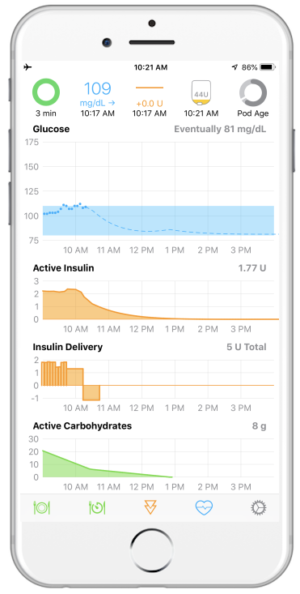
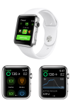

# Welcome to Loop

## Introduction

Loop is an app you build yourself and load on your iPhone (or iPod) that uses a compatible continuous glucose monitor (CGM) and is paired using a radio-link with your compatible pump. Loop assists in the many dosing decisions people with diabetes face every day. Loop works with older Medtronic pumps and the Eros (not Dash) Omnipods.  For the CGM, the Loop app works with Dexcom’s CGM or one of the Medtronic Sensors, but there are other versions of Loop available that may work for you if you are not using one of these specific CGMs.  These other versions (known as forks) are created by Loop users and are maintained by them. This document does not cover those other CGM options, but check out the [community information](index.md#stay-in-the-loop) below.

{width="300"}
{width="300"}

!!! warning "Important"
    Please understand that this project:

    - Is highly experimental
    - Is not approved for therapy

    **You take full responsibility for building and running this system and do so at your own risk.**

The Loop algorithm on your phone predicts future glucose based on carbohydrate intake, insulin on board, and current CGM readings. You enter your own settings for desired correction range, basal schedule, insulin sensitivity factor (ISF), carbohydrate ratio (CR) and the type of insulin you are using.  The glucose forecasts, using your settings and meal entries, provide Loop with the information needed to recommend a bolus or temporary basal rate to attain a targeted glucose range in the future.

The system can either operate “open-loop” by making recommendations to the user for their approval before enacting or “closed-loop” by automatically providing the recommended increase or decrease in insulin delivery.

You may be saying - I can't build an app. But the wonderful volunteers in this community prepared this amazing website with step-by-step instructions containing pictures and arrows (say thank you to Katie DiSimone). The website is updated by more volunteers as improvements are made to the Loop app and when Apple makes changes to their iOS, Xcode and macOS environment. This language may sound scary, but it will become easier. Most people who Loop want to keep looping.

Once you've built the app, plan to learn to use it in stages. First run “open loop” to familiarize yourself with Loop’s operation. This allows you to understand why Loop is making certain recommendations and determine if you need to adjust settings for Loop.

One thing many new users ask is why do my settings need to be different for Loop?  The main reason is that Loop uses a realistic model of insulin activity in your body including the long tail - and updates its calculations every 5 minutes.  You might have used a linear fall-off of insulin activity and corrected once every 2 or 3 hours. You might also have traded off higher basal rate to avoid worrying about snacks.  There's a whole section on settings - just giving you a heads up.

When you progress to “closed-loop”, do so safely by starting with appropriate safety limits and only progress to tighter limits after several days of no lows. Please ask questions at this point about why Loop is making the recommendations it does.  It should be similar to the therapy decisions you would make yourself.  If the recommendations it makes are different than you would make, try to figure out why. Hint - it's probably your settings.

## How to Use These Docs

* Use the navigation menu at the top of the screen
    * Most menu items are only one level deep - so you see all the underlying pages by clicking on the menu name
    * Operate has 4 drop-down menus, easiest way to go through these pages is hitting Next or the letter `n`
        * Operate->How To Use Loop App
        * Operate->Looping Tips
        * Operate->Algorithm
        * Operate->Troubleshoot
* Use the Table of Contents for the current page, which is displayed on the left side of the screen
    * On mobile devices, at the top of the page, tap the down arrow on the upper left to display the TOC, tap again to dismiss it
* Read pages sequentially first time through
    * Type the letter `n` for next and `p` for previous to navigate
* Search for topics by clicking the Search icon or typing the letter `s` on your keyboard
    * As you type in the search box, suggested section headings with the first few rows of content will show up below the search bar
    * Scroll down and select the Heading Title of the section of interest
    * If you hit return, the Search display vanishes
  {width="400"}  
* There is another website [Looptips](https://kdisimone.github.io/looptips/) you should review
    * While these articles were written and illustrated with an earlier version of Loop, they are well worth reading
    * This link is repeated on the Operate->Looping Tips->Loop Tips page

## Stay in the Loop!

There are a number of social media options. (Read the directions on each of these - some ask you to answer questions - please do so):

  * The fastest way to get help (with the most number of mentors) is to join [The Looped Facebook Group](https://www.facebook.com/groups/TheLoopedGroup).
  * There's another group [LoopandLearn](https://www.facebook.com/groups/LOOPandLEARN) that has a lot of Loop-centric information, provide supports for some Loop forks (remember other CGM?) and has a Speaker Series covering many topics of general Diabetes interest as well as Loop-specific chats.
  * Many Loopers use the Nightscout tool to assist in monitoring their settings in Loop. The fastest Nightscout help can be found in the original #wearenotwaiting community [CGM in the Cloud](https://www.facebook.com/groups/CGMinthecloud).
  * For those not interested in Facebook or interested in what's coming next for Loop, join [Loop Zulipchat](https://loop.zulipchat.com) and be sure to subscribe to all the channels.  
      * Note - please only post in one channel at zulipchat - the mentors are subscribed to all of them.
  * And for those interested in delving deeper, see the next two sections.

## Contribute

Please consider submitting suggestions for updates and improvements to this documentation or [code](index.md#information-for-coders). For documentation, please enter an Issue at the [loopdocs repo](https://github.com/LoopKit/loopdocs/issues). See what issues are already open - if yours is new, please add it by clicking on the `New Issue` button. Indicate what page or pages need updating with a brief description, and we'll collaborate from there. There are over 70 pages of content and we need all the reviewers we can get to help find typos and pages that need to be updated.

## Development History

Loop has been developed as an open-source, shared project.  

  * For a really interesting read about the history of Loop development, check out this [History of Loop and LoopKit](https://medium.com/@loudnate/the-history-of-loop-and-loopkit-59b3caf13805) post, written by Loop developer Nate Racklyeft

  * If you're an Omnipod user, you may find this article interesting [Insulin Pumps, Decapped chips and Software Defined Radios](https://medium.com/@ps2) written by Loop developer Pete Schwamb

  * For all Loopers, read about the early days and the many advances brought about by the greater Diabetes Community of people who are not waiting in [The Artificial Pancreas Book](https://www.artificialpancreasbook.com/) written by Dana Lewis and check out her website [DIYPS](https://diyps.org)

The project continues to be a labor-of-love by a community of users; maintained and improved by volunteers.

## Information for Coders

[Loop](https://github.com/LoopKit/Loop) is an app template for building an automated insulin delivery system. It is a stone resting on the boulders of work done by many others.

The app is built on top of [LoopKit](https://github.com/LoopKit/LoopKit). LoopKit is a set of frameworks that provide data storage, retrieval, and calculation, as well as boilerplate view controllers used in Loop. Using the open-source Loop app template, you can build an insulin delivery system that uses specific commercial and open-source hardware and software technologies to bring together the insulin pump, continuous glucose monitor (CGM), and insulin dosing algorithm to create a continuous insulin basal dosing “Loop”.  

For more information on how to contribute to an open-source project, please review:

  * [How to Contribute to Open Source](https://opensource.guide/how-to-contribute/)
  * Review the Loop [LICENSE](https://github.com/LoopKit/Loop/blob/master/LICENSE.md)
  * Review the Loop [CODE_OF_CONDUCT](https://github.com/LoopKit/Loop/blob/master/CODE_OF_CONDUCT.md)

Then if you want to contribute, please join [Loop Zulipchat](https://loop.zulipchat.com) and be sure to subscribe to all the channels. Meet the developers and testers who make this app the life-changing tool that so many people use. Learn about what is coming next.
