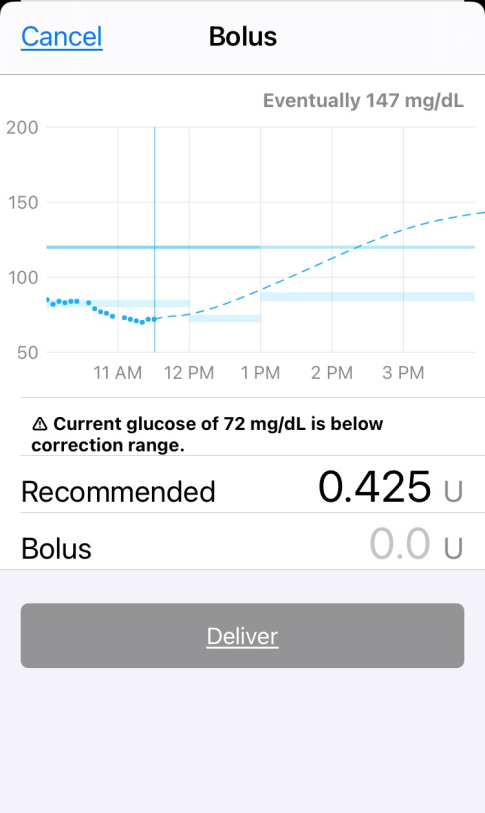

# Bolus

{width="300"}
{align="center"}

Bolus entries can be made manually through the bolus tool (double orange triangles) in the toolbar, either as part of a meal bolus or as a correction for a high BG.

## Meal Bolus

[Click here for Meal Entry](https://marionbarker.github.io/loopdocs/operation/features/carbs)

{width="300"}
{align="center"}

## Correction Bolus

Loop reassesses your insulin needs every 5 minutes, also known as a Loop interval.  If Loop is calculating that your BG will not be able to stay within your correction range, it will calculate a Recommended Bolus, known as a “correction bolus”.

If you are using the Master branch, you will see a Recommended amount when you click on the Bolus tool.  This Recommended bolus will not be delivered automatically, it must be delivered by you, the Looper. Loop will not give an alert when a correction bolus is being recommended, the bolus entry tool must be clicked to check for one. The Loop pill in Nightscout will display when Loop has a recommended bolus calculated. In a well-tuned Loop with decent carb counting, correction boluses should be infrequently needed.  If you are not continually clicking on the bolus tool and happen to miss the recommended correction bolus, Master branch will increase your temp basals for as long as it takes to deliver the required insulin.  The increase in your temp basals is subject to your Delivery Limits, and is reassessed every Loop interval.

If you are using the Automatic-Bolus branch (AB), Loop will deliver the recommended bolus via either temp basals or boluses, depending upon your Dosing Strategy.  The amount of insulin delivered via boluses is 40% of the recommended bolus amount and is reassessed every Loop interval.  During subsequent Loop intervals, you receive 40% of any remaining recommended bolus.

## Starting Bolus Notification

A new status line will appear when Loop is sending a bolus command to the pump. Just above the main screen's Glucose chart, you will see a "starting bolus" indicator.

{width="300"}
{align="center"}

## Bolus Failure Notifications

On occasion, you will receive notification that a bolus may have failed. In some of these cases, the bolus actually will begin delivery. On a Medtronic pump, you should always check the pump screen to verify the bolus status before attempting to redeliver a failed bolus.  Omnipod users should .....
