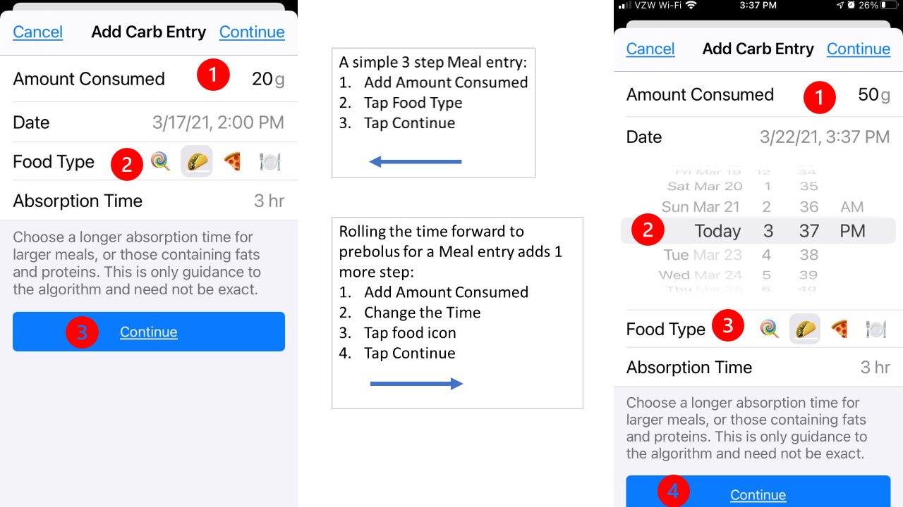
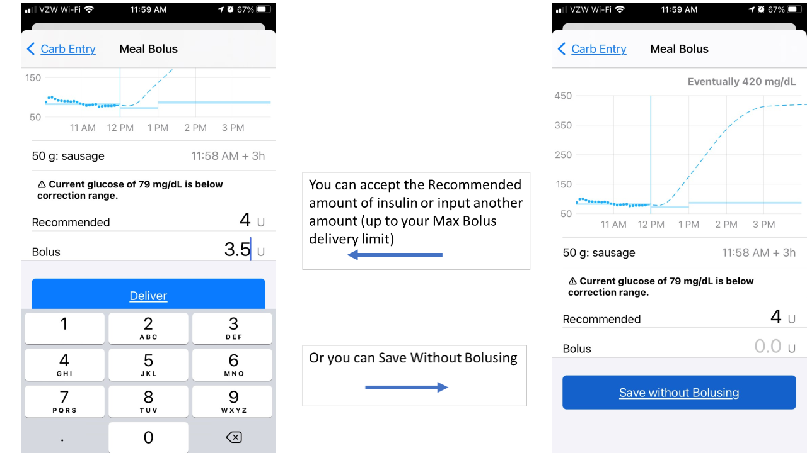
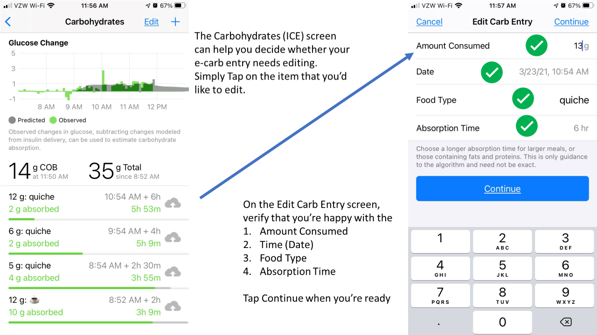
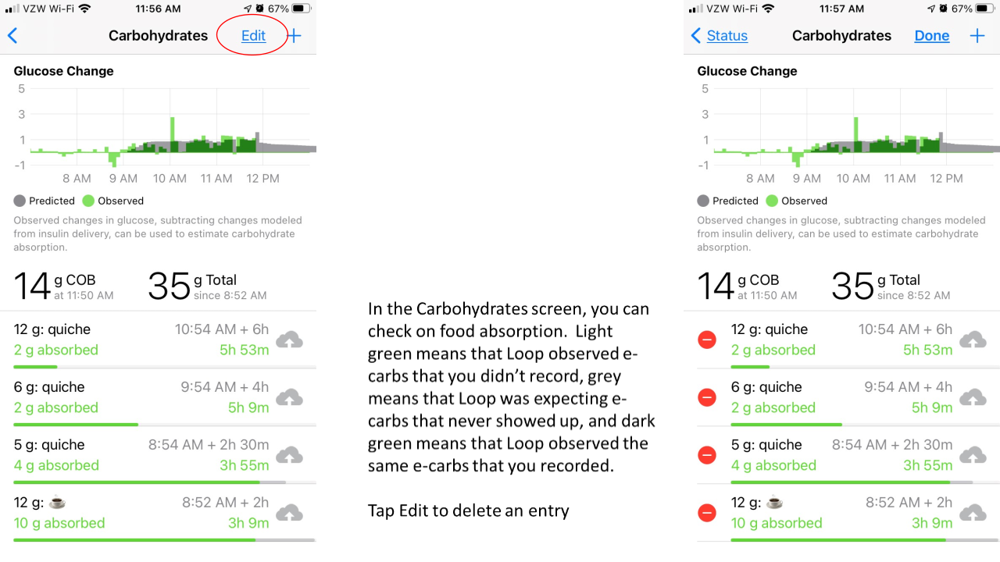

# Meal Entry (Carbs, Fats and Proteins)

{width="300"}
{align="center"}

To start a new meal entry, tap on the green meal icon in the toolbar at the bottom left of the status screen. Your Loop app will open to Add Carb Entry screen, but you should think of this as a meal entry. Successful Loopers bolus for carbs, as well as for a % of their fats and proteins.  We'll use the term e-carbs to describe equivalent carbs.

Below are step by step instructions on how to record meals in Loop, but first, here are a few methods that you cannot use: you cannot use your pump's bolus wizard, you cannot use your pump's carb entry screen, and you cannot use Nightscout's careportal.

{width="900"}
{align="center"}

## New Meals

Once you're in the Add Carb Entry screen, to start recording your meal, simply enter the desired number of e-carbs in the `Amount Consumed` line.  

The default 'Date' is the current date and time, but you can easily scroll the time forward or back.  If you had inadvertently missed recording an earlier meal, just scroll the time back to when that food started to absorb.  If you want to prebolus some portion of the meal that you're about to eat, just scroll the time forward.  You can prebolus part of your meal with the current time, and then record a second entry by scrolling the time forward for an hour or two to prebolus for a steak that may not start absorbing right away.  

Next, you'll want to select your Food Type. Initially, there are 4 options: lollipop, taco, pizza and plate.  The default food type is taco, which has a default absorption time of 3 hours. You can either tap on the food icon that most closely resembles what you're eating, or tap on the plate to reveal even more food icons.  Pick the lollipop if the food that you're going to be eating has a 2 hour absorption, the taco for 3 hour absorption or the pizza for 4 hour absorption.  If you tap on plate, there are lots more food icons for you to choose from, and they're arranged based upon how long each food takes to absorb, or you have the option to tap on the `abc` that appears in the lower left corner and manually type in your food entry.  

The next step is to set your Absorption Time. You can accept the default absorption times of 2, 3 or 4 hours OR you can enter any time that you'd like up to 8 hours. Loop will initially estimate your absorption time at 150% of the time that you enter.  As a result, e-carbs entered using the taco icon will initially be treated as 4.5 hour absorption.  As Loop observes the BG impacts of the meal, Loop will shorten the meal's absorption time or increase the number of e-carbs to be absorbed, as well as adjust insulin delivery.  

You do not have to enter all e-carbs for a meal at the same absorption or eating time.  If you want to enter some of the meal's e-carbs as faster and some as slower, you can log the meal over several individual entries.  For example, for meals that have sugary carbs as well as slow acting carbs (Chinese food), you may want to do record some e-carbs as lollipop and some as pizza. Another example would be steak and potatoes, you may want to record the potatoes with a current starting time and taco absorption and the steak with a starting time of 1-2 hours into the future and use a 5 hour absorption time.

{width="900"}
{align="center"}

When you are done recording your food entry, press `Continue` and the Meal Bolus tool will open.  You can tap on the `Recommended` bolus to accept Loop's recommendation OR tap on 0.0u on the `Bolus` row and type in your desired bolus amount OR `Save Without Bolusing` if you'd like to add to your meal entry. The graph at the top of the Meal Bolus screen will show your BG prediction based upon your meal entry and desired bolus amount. You can adjust your desired bolus amount or click `< Carb Entry` to adjust your meal entry to see how your BG prediction changes.  When you're ready to bolus, click `Deliver`.  Do not bolus until you've completed your entire meal entry.

## Automatic-Bolus (AB) Branch

Loopers who are using AB still need to prebolus and bolus for meals. The amount of `Recommended` insulin that will appear in the Meal Bolus screen will be the full amount of the bolus (not 40%).  As discussed above, you can accept this recommendation or enter a different amount, however, and this is very important, by entering less than the recommended amount and tapping `Deliver`, you are telling Loop to deliver the remaining insulin in the future and the future may be as short as the very next Loop interval, which is approximately 5 minutes away.

{width="900"}
{align="center"}

## Edit Meals

You can watch the progression of the Loop's observations of your meal by tapping on the Active Carbohydrates chart at the bottom of Loop's main screen and watching the insulin counteraction effects (ICE) on the Carbohydrates screen to see the same-day history of the meals that you have recorded. The information available on the Carbohydrates screen disappears at midnight, so if you're looking for details as to how a particular meal absorbed, you need to screenshot or otherwise capture this information before midnight. Previous entries can be modified or deleted through this screen.  To adjust an entry, simply tap on it.   You can change a prebolus time, add/subtract e-carb entries, or adjust absorption times (even mid-meal). To delete an entry, just click `Edit` and tap on the red circle to the left of the entry that you would like to delete.  Be careful with the `Edit` button, it is a little counterintuitive, but the `Edit` button let's you delete, but not edit an entry.  Adjusting a meal entry can be a particularly useful tool when:

* You did not finish an entire meal that you bolused for,
* You did not get to eat the meal at the time you originally expected,
* You ate more servings than originally entered, or
* You suspect your carb count was in error because BGs are rising more/less than expected.

{width="900"}
{align="center"}

## Avoid Double Meal Entries

!!! info "Be Aware"

    **Simply canceling a bolus does not cancel the meal entry.**

    If you have accidentally made duplicative entries for the same meal, click on the Active Carbohydrates chart in the main Loop screen and tap `Edit` to delete the redundant entries.  Deleting the meal entry will not impact the insulin that has already been delivered, but it will alert Loop to adjust your BG projection for purposes of calculating future insulin delivery.

## Third Party Apps

If you use a 3rd party app, such as My Fitness Pal, to enter and track carbs and that app also stores the carb values in Apple Health, Loop will read those values from Apple Health and use them in calculating temp basal rates. Entries from 3rd party apps cannot be removed from within Loop.  You will have to edit them in the third party app, or from the Health app. Because of this potential for confusion, it is recommended to turn off Loop's ability to read other apps' carbohydrate data from with the Health app. You are asked if you want to enable this when Loop is first installed. After installation, you can also go to the Settings App -> Privacy -> Health -> Loop and scroll down to the Allow Loop to Read Data section to turn off `Carbohydrates`.

## Non-linear Carb Absorption Model

Beginning with Loop v2.0 (released in December 2020), the algorithm incorporates a non-linear carb absorption model. The non-linear carb absorption model assumes that food absorbs faster initially (after a delay) and slower later on. The non-linear carb absorption model initially estimates that your food will take 50% longer to absorb than the time that you enter.  For a more detailed explanation of the carb absorption model, please read about it here.  (https://marionbarker.github.io/loopdocs/faqs/branch-faqs.md#non-linear-carb-model)  
