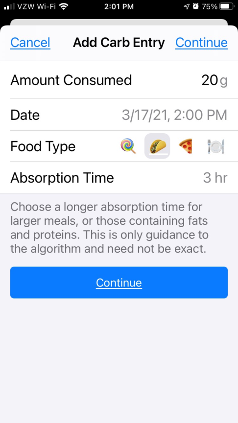
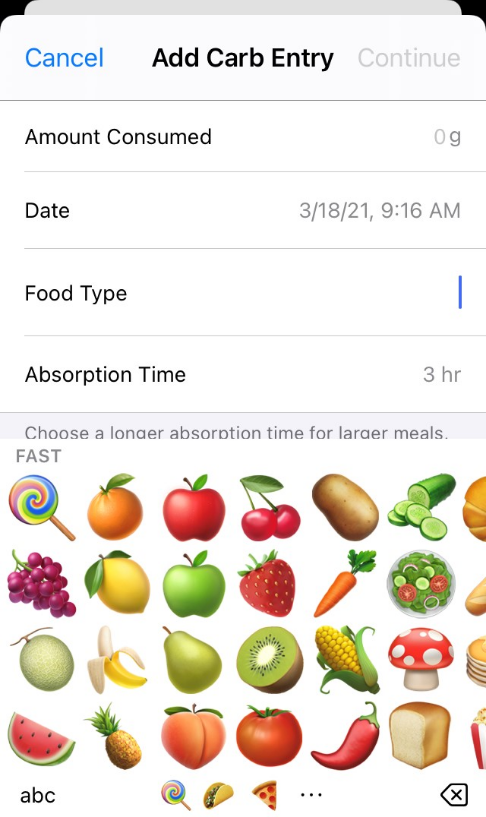

# Meal Entry (Carbs, Fats and Proteins)

{width="400"}
{align="center"}

New meal entries are made by using the green meal icon in the toolbar at the bottom left of the status screen. Your Loop app will open to `Add Carb Entry` but you should think of this as a meal entry. Successful Loopers bolus for carbs, as well as for a % of their fats and proteins.  We'll use the term e-carbs to describe equivalent carbs.

You cannot use your pump's bolus wizard or pump's carb entry to record meals into the Loop app.  You cannot use Nightscout's careportal to enter your meal, as Loop does not read meal entries remotely.

## New Meals

To begin a new meal entry, simply enter the desired number of e-carbs in the `Amount Consumed` line. The default absorption time for a new entry is 3 hours (taco icon) as long as you haven't made any customizations to absorption times during your Loop build.  The default 'Date' is the current date and time.  Once you press `Continue` on the Add Carb Entry screen, Loop's Meal Bolus tool will open and provide you with a few options.  You can click `Save Without Bolusing` if you'd like to add to your meal entry OR tap on `Recommended` to accept Loop's recommended bolus OR tap on 0.0u on the `Bolus` row and type in your desired bolus amount. The graph at the top of the Meal Bolus screen will show your BG prediction based upon your meal entry and desired bolus amount. You can adjust your desired bolus amount or click `< Carb Entry` to adjust your meal entry to see how it changes your BG prediction.  If you are recording a multipart meal, click on `Save Without Bolusing` and record the rest of your meal. When you're ready to bolus, click `Deliver`.  Do not bolus until you've completed your entire meal entry.

{width="300"}
{align="center"}

## Avoid Double Meal Entries

!!! info "Be Aware"

    **Simply canceling a bolus does not cancel the meal entry.**

    If you have accidentally made duplicative entries for the same meal, click on the Active Carbohydrates Chart in the main Loop screen and tap `Edit` to delete the redundant entries.  Deleting the meal entry will not impact the insulin that has already been delivered, it will only alert Loop to adjust your BG projection for purposes of calculating future insulin delivery.

## Carb Absorption Time

{width="300"}
{align="center"}

You will find that your meal's e-carbs have different absorption times.  To select your e-carb absorption time, you can either click on the default food icons or manually enter absorption time by selecting the `Absorption Time` line in the Add Carb Entry screen.

Tapping the plate in the `Food Type` row can also be used if you are unsure of a new food.  The food icons are grouped based upon their relative absorption times - fast, medium, and slow. If you'd prefer, you can type-in your `Food Type` by selecting the `abc` button in the bottom left corner of the screen.

{width="300"}
{align="center"}

{width="900"}
{align="center"}{width="300"}
{align="center"}

Beginning with Loop v2.0 (released in December 2020), the algorithm incorporates a [non-linear carb absorption model](../../faqs/branch-faqs.md#non-linear-carb-model). The non-linear carb absorption model assumes that food absorbs faster initially (after a delay) and slower later on.  For a more detailed explanation of the carb absorption model, please read about it [put link here - the discussion in Zulip is disjointed and disorganized.  I couldn't find a great cohesive explanation]

To help Loop adjust for e-carbs that may digest slower than your original estimate, Loop will initially estimate your absorption time at 150% of the time that you enter.  As a result, e-carbs entered using the taco icon will initially be treated as 4.5 hour absorption.  As Loop observes the BG impacts of the meal, Loop will shorten the meal's absorption time or increase the number of e-carbs to be absorbed, as well as adjust insulin delivery.  You can watch the progression of the Loop's observations of your meal by clicking on the Carbs Chart and watching the insulin counteraction effects (ICE).  The information available on the ICE screen disappears at midnight, so if you're looking for details as to how a particular meal absorbed, you need to screenshot or otherwise capture this information before midnight.

## Mixed Meals

You do not have to enter all e-carbs for a meal at the same absorption or eating time.  If you want to enter some of the meal's e-carbs as faster, and some slower, you can log the meal over several individual entries.  For example, for meals that have sugary carbs as well as slow acting carbs (Chinese food), you may want to do record some e-carbs as lollipop and some as pizza. Another example would be steak and potatoes, you may want to record the potato with a current starting time and taco absorption and the steak with a starting time of 1-2 hours into the future and use a 5 hour absorption time.

Pressing the blue `Continue` button will bring up Loop's Meal Bolus tool.  When recording multiple entries for a single meal, press `Save Without Bolusing` on the Meal Bolus tool.  When you have entered your last e-carb entry for the meal, then use the Meal Bolus tool to deliver the bolus for the entire meal.  Loop will provide a recommendation based on all the saved entries and their respective absorption durations in total. Tap on `Recommended` to accept Loop's recommended bolus OR tap on 0.0u on the `Bolus` row and type in your desired bolus amount. The graph at the top of the Meal Bolus screen will show your BG prediction based upon your meal entry and desired bolus amount. You can adjust your desired bolus amount or click `< Carb Entry` to adjust your meal entry to see how it changes your BG prediction.   When you're ready to bolus, click `Deliver`.  Do not bolus until you've completed your entire meal entry.

## Automatic-Bolus (AB) Branch

Loopers who are using AB will still need to prebolus and bolus for meals.  The amount of `Recommended` insulin that will appear in the Meal Bolus screen will be the full amount of the bolus (not 40%).  As discussed above, you can accept this recommendation or enter a different amount, however, and this is very important, by entering less than the recommended amount and tapping `Deliver`, you are telling Loop to deliver the remaining insulin in the future and the future may be as short as the very next Loop interval, which is approximately 5 minutes away.

## Prebolus

You can prebolus by either tapping on the Bolus tool (double orange triangles) in the center of the Toolbar at the bottom of your Loop main screen, or by recording some portion of your expected meal in the Add Carb Entry screen.  You can adjust the time of the meal entry on the “Date” line of the e-carb entry.  If you are prebolusing by 20 minutes, just roll the time forward by 20 minutes.  

## Edit Meals

Tapping on the Carbohydrate chart in the Loop's main status screen will open the entry history.  Previous entries can be modified or deleted through this screen.  You can change a prebolus time, add/subtract e-carb entries, or adjust absorption times (even mid-meal). To delete an entry, just click `Edit` and tap on the red circle to the left of the entry that you'd like to delete.  To edit an entry, tap on the entry to revel the Edit Carb Entry screen.  This can be a particularly useful tool when:

* You did not finish an entire meal that you bolused for,
* You did not get to eat the meal at the time you originally expected,
* You ate more servings than originally entered, or
* You suspect your carb count was in error because BGs are rising more/less than expected.

{width="300"}
{align="center"}

## Third Party Apps

If you use a 3rd party app, such as My Fitness Pal, to enter and track carbs and that app also stores the carb values in HealthKit, Loop will read those values from Apple HealthKit and display and use them in calculating temp basal rates. Entries from 3rd party apps can not be removed from within Loop.  You will have to edit them in the third party app, or from the Health app. Because of this potential for confusion, it is recommended to turn off Loop's ability to read other apps' carbohydrate data from HealthKit. You are asked if you want to enable this when Loop is first installed. After installation, you can also go to the Settings App -> Privacy -> Health -> Loop and scroll down to the Allow Loop to Read Data section to turn off `Carbohydrates`.
